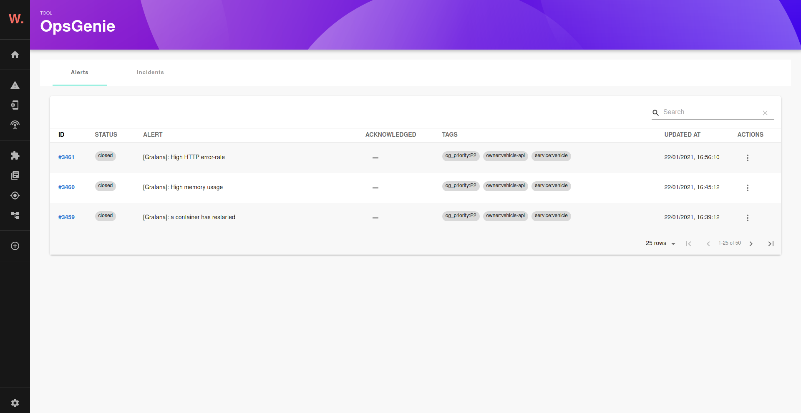
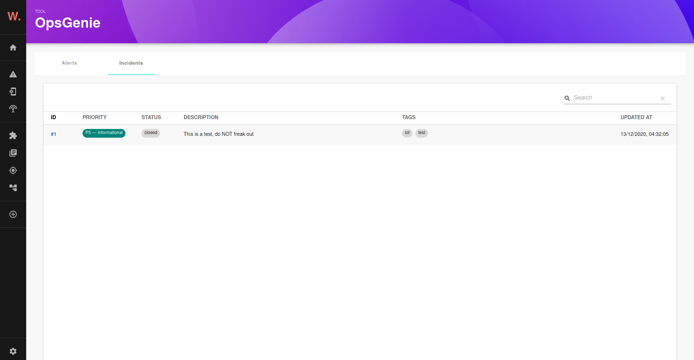
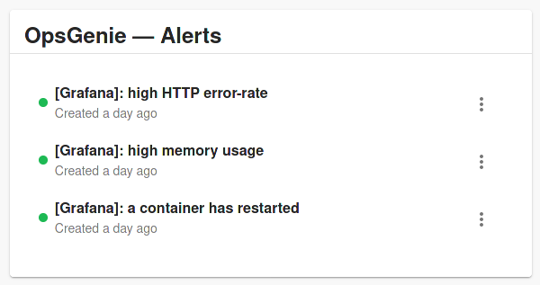

# OpsGenie plugin for Backstage

Welcome to the OpsGenie plugin!

Alerts page:


Incidents page:


Alerts card:


## Plugin Setup

1. If you have standalone app (you didn't clone this repository), then do:

```bash
yarn add @k-phoen/backstage-plugin-opsgenie
```

2. Configure the plugin:

```yaml

proxy:
  '/opsgenie/api':
    target: https://api.eu.opsgenie.com
    headers:
      Authorization: GenieKey [[ API KEY here ]]

opsgenie:
  domain: https://my-app.app.eu.opsgenie.com/
```

**Note:** this plugin requires an API key issued from an integration. They can be retrieved from the "Settings" tab and then "Integrations" tab.

3. Add the plugin to the list of plugins:

```ts
// packages/app/src/plugins.ts
export { plugin as PluginOpsgenie } from '@k-phoen/backstage-plugin-opsgenie';
```

4. Expose the plugin to your Backstage instance:

```ts
// packages/app/src/App.tsx
import { Router as OpsGenieRouter } from '@k-phoen/backstage-plugin-opsgenie';

// ...

const AppRoutes = () => (
  <Routes>
    /// ...
    <Route path="/opsgenie/*" element={<OpsGenieRouter />} />
    // ...
  </Routes>
);
```

5. Add it to the `EntityPage.ts`:

```ts
import {
  AlertsCard as OpsGenieAlertsCard,
  isPluginApplicableToEntity as isOpsGenieAvailable
} from '@k-phoen/backstage-plugin-opsgenie';

// add to code

{
  isOpsGenieAvailable(entity) && (
    <Grid item>
      <OpsGenieAlertsCard entity={entity} />
    </Grid>
  );
}
```

6. Run backstage app with `yarn start` and navigate to services tabs.


## Components annotations

In order for this plugin to know what alerts belong to which component, a selector must
be defined:

```yml
annotations:
  opsgenie.com/component-selector: 'tag:"service:my-awesome-service"'
```
