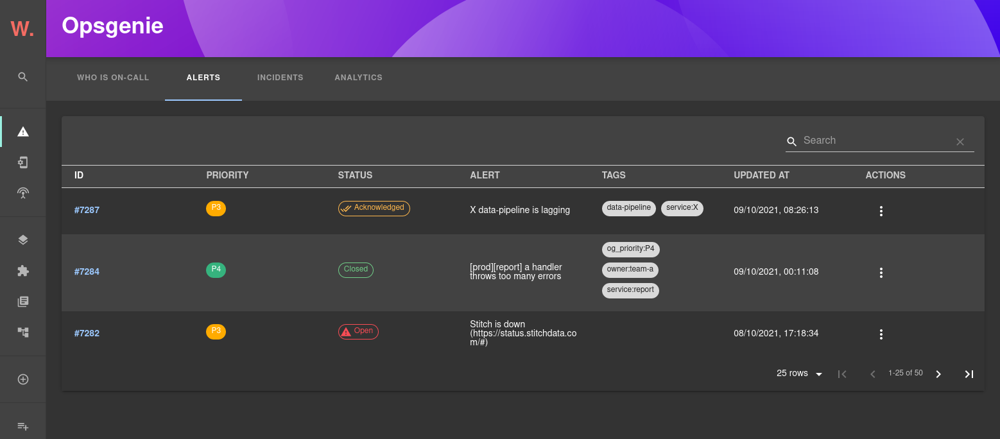
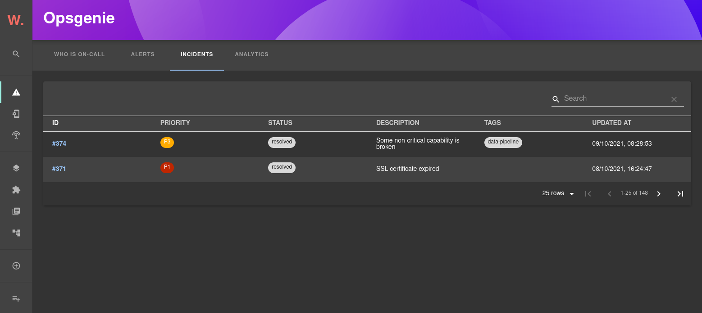

# Opsgenie plugin for Backstage

The Opsgenie plugin is a frontend plugin that displays Opsgenie alerts, incidents and on-call information in Backstage. The plugin includes two components that can be integrated into Backstage:

*  The `OpsGeniePage` routable extension component which produces a standalone page with the following capabilities:
    * view a summary of who is currently on call
    * view and search a list of active alerts with the option of acknowledging or closing alerts directly from Backstage
    * view and search a list of incidents
    * view incident-related analytics
* The `EntityOpsgenieAlertsCard` component which can display recent alerts for a specific component.

## Setup

Find [installation instructions](./docs/index.md#installation) in our documentation.

## How does it look?

Alerts page:

Incidents page:

Alerts card:

## License

This library is under the [MIT](LICENSE) license.