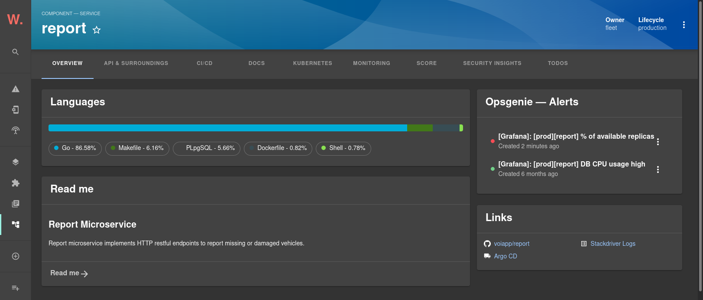
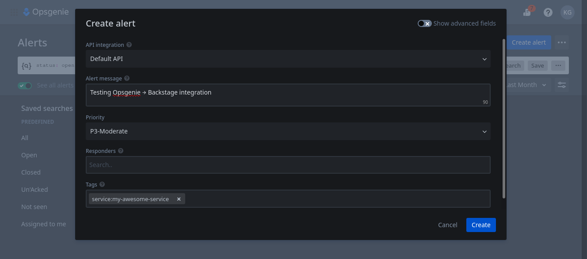

# Display alerts on a component page

Adding the `EntityOpsgenieAlertsCard` component to an entity's page will display a list of the most recent alerts related to that entity.

```ts
// packages/app/src/components/catalog/EntityPage.tsx

import {
  EntityOpsgenieAlertsCard,
  isOpsgenieAvailable
} from '@essent/backstage-plugin-opsgenie';

// ...

const overviewContent = (
  <Grid container spacing={3} alignItems="stretch">
    <Grid item md={6}>
      <EntityAboutCard variant="gridItem" />
    </Grid>
    <Grid item md={6}>
      {/* OpsGenie alert card start */}
      <EntitySwitch>
        <EntitySwitch.Case if={isOpsgenieAvailable}>
          <EntityOpsgenieAlertsCard title="OpsGenie — Alerts" />
        </EntitySwitch.Case>
      </EntitySwitch>
      {/* OpsGenie alert card end */}
    </Grid>
    <Grid item md={4} xs={12}>
      <EntityLinksCard />
    </Grid>
    <Grid item md={8} xs={12}>
      <EntityHasSubcomponentsCard variant="gridItem" />
    </Grid>
  </Grid>
);
```



Opsgenie alerts are correlated to Backstage entities using an annotation added in the entity's `catalog-info.yaml` file:

```yml
annotations:
  opsgenie.com/component-selector: 'tag:"service:my-awesome-service"'
```

This annotation accepts any valid [Opsgenie search query](https://support.atlassian.com/opsgenie/docs/search-queries-for-alerts/) for alerts.

You can test your configuration and selectors by creating alerts from Opsgenie:



Note that the tag added to this alert matches the search query defined above.