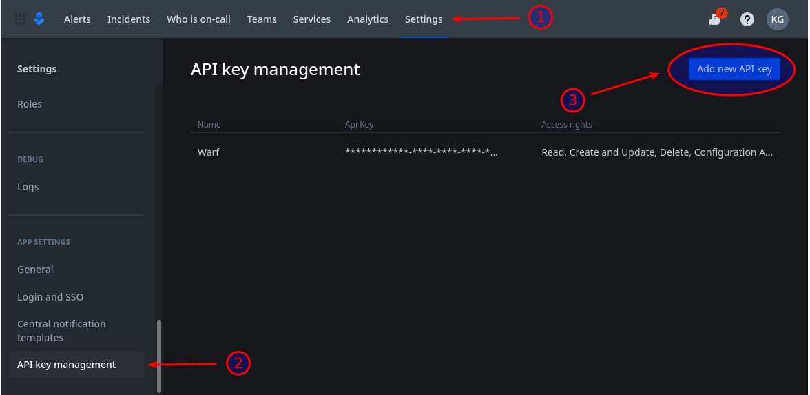
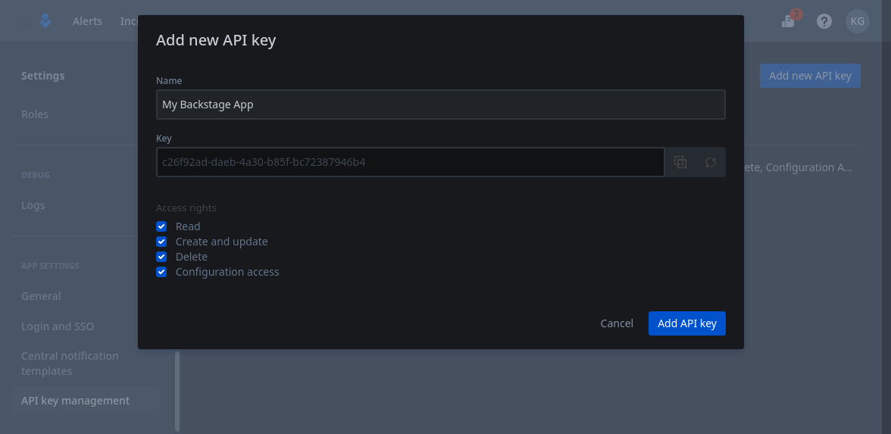

# Creating an Opsgenie API key

Because of the features provided by the plugin, an API key with full access to your Opsgenie domain is required.
Read access is needed to list alerts, write access to acknowledge them directly from Backstage, …

Such API key can be created from the "Settings" panel, under the "API key management" section:

Make sure you choose a descriptive name for your API key and configure the access rights as follow:

Once the API key is added, use it as value for the `OPSGENIE_API_KEY` environment available to make it available to the plugin.