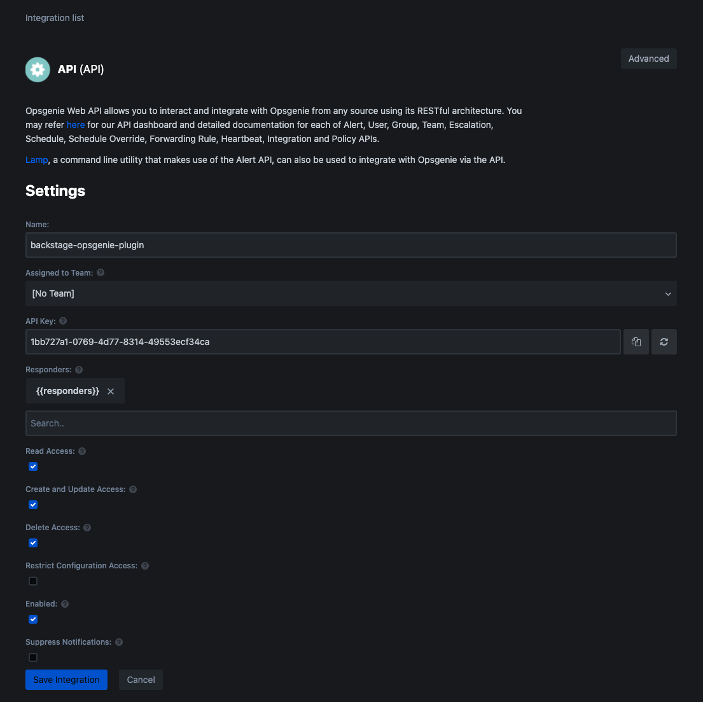

# Creating an Opsgenie API key

Because of the features provided by the plugin, an API key with full access to your Opsgenie domain is required.
Read access is needed to list alerts, write access to acknowledge them directly from Backstage, …

## How to create an integration for backstage-opsgenie-plugin

1. Go to `Settings` -> `Integrations` -> `Add Integration`

1. Select "API" integration type

1. Copy Generated API Key and click `Save Integration`

    

1. Once the API key is added, use it as value for the `OPSGENIE_API_KEY` environment variable to make it available to the plugin.