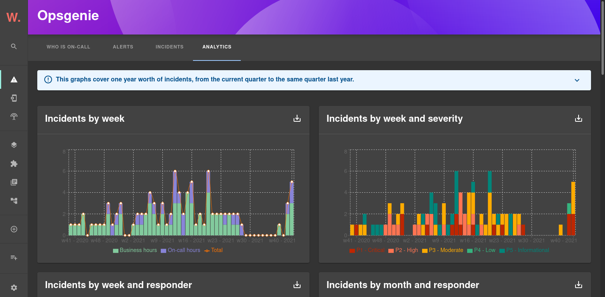

# Incidents analytics

The "Analytics" page uses Opsgenie API to automatically generate metrics to help you and your team learn from past incidents.

The following metrics are generated for one year worth of incidents, from the current quarter to the same quarter last year:

* Incidents by week, with distinction between office hours and on-call hours
* Incidents by week and severity
* Incidents by week and responder
* Incidents by month and responder
* Incidents by quarter and responder
* Incidents by day of the week and responder
* Incidents by hour
* Average impact duration by week and responder



Business vs on-call hours can be configured in the `app-config.yaml` file:

```yaml
# app-config.yaml
opsgenie:
  analytics:
    businessHours: {start: 9, end: 18}
```

The responding team can be overridden by setting the `responder` extra property on an incident.